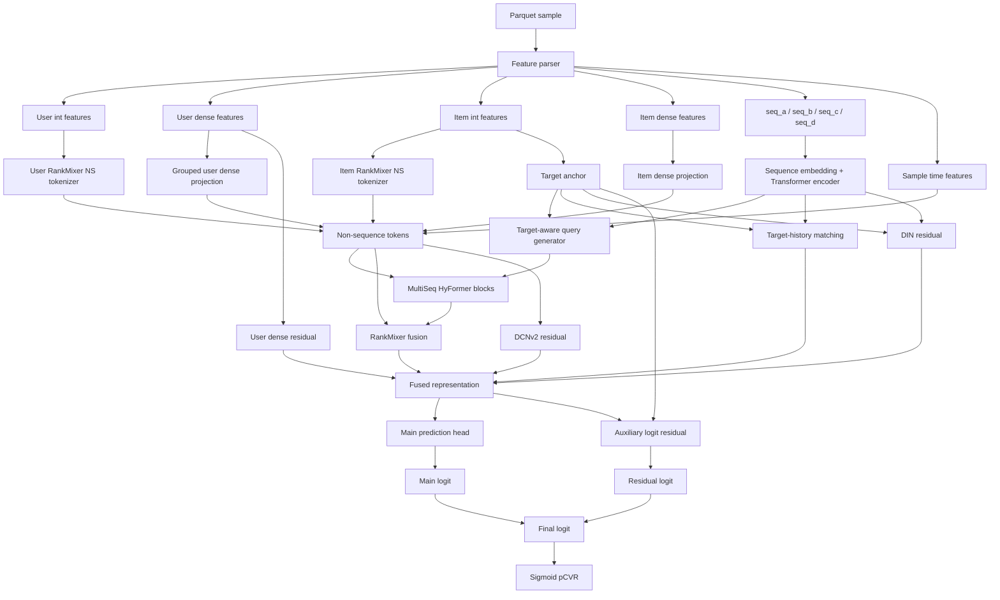

# DenseGroup MaxAUC SOTA

<p align="center">
  
  
  
  
</p>

[English](README_EN.md)

DenseGroup MaxAUC SOTA 是腾讯广告算法大赛 pCVR 预估任务的最终提交方案。模型以 HyFormer 多行为序列建模为主干，融合用户/商品离散特征、dense 数值特征、四路行为序列与样本时间特征，并通过四条 zero-init residual 分支补强 AUC。

- 比赛链接：[Tencent Ads Algorithm Leaderboard](https://algo.qq.com/leaderboard)
- 最终排名：53 / 1875，Top 2.83%
- Eval AUC：0.832181
- 最终配置：四条 MaxAUC residual 分支全开，`emb_skip_threshold=1100000`，`ema_decay=0.9995`

## 方法亮点

| 模块 | 设计 |
| --- | --- |
| 多序列主干 | `seq_a/seq_b/seq_c/seq_d` 经 Transformer encoder 编码，再由 target-aware query generator 和 HyFormer block 融合 |
| 非序列特征 | user/item int features 经过 RankMixer NS tokenizer，dense features 经过分组投影生成 NS tokens |
| 目标匹配 | target anchor 与历史行为序列进行 target-history matching，显式建模当前广告与用户历史兴趣的相关性 |
| MaxAUC 分支 | user dense residual、DIN-style target-aware sequence residual、DCNv2 cross residual、auxiliary logit residual |
| 训练增强 | Focal Loss 处理稀疏转化标签，EMA 权重滑动平均与 raw/EMA 双路验证选优 |
| 工程优化 | Parquet 流式读取、row-group 验证切分、序列截断补齐、高基数 embedding 过滤、bf16 autocast |

## 网络结构



## 目录结构

```text
densegroup_maxauc_sota/
├── dataset.py          # Parquet IterableDataset, schema parser, sequence padding
├── model.py            # PCVRHyFormer + MaxAUC residual branches
├── train.py            # Training entry point and CLI flags
├── trainer.py          # Focal/BCE training loop, AUC eval, EMA checkpoint selection
├── utils.py            # logging, seed, early stopping, focal loss helpers
├── densegroup.py       # dense feature grouping helper
├── ns_groups.json      # optional group-tokenizer config, not used by SOTA run.sh
├── run.sh              # final SOTA training command
├── eval/
│   ├── infer.py        # evaluation/inference entry point
│   ├── dataset.py      # eval-side dataset copy
│   └── model.py        # eval-side model copy
├── requirements.txt
├── README.md
└── README_EN.md
```

## 环境安装

建议 Python 3.10+ 和支持 bf16 autocast 的 CUDA GPU。

```bash
pip install -r requirements.txt
```

核心依赖包括 PyTorch、NumPy、PyArrow、scikit-learn、tqdm 和 TensorBoard。

## 数据格式

训练数据目录需要包含：

```text
TRAIN_DATA_PATH/
├── schema.json
└── *.parquet
```

`schema.json` 描述 user/item int features、dense features 和序列特征的 feature id、offset、length 与 vocab size。Parquet 数据由 `dataset.py` 流式读取，并自动构建：

- `user_int_feats`
- `user_dense_feats`
- `item_int_feats`
- `item_dense_feats`
- `seq_a/seq_b/seq_c/seq_d`
- `*_len`
- `*_time_bucket`
- `sample_day_id/sample_hour_id/sample_hour_sin/sample_hour_cos`
- `label`

比赛数据本身不随代码发布。

## 训练

```bash
export TRAIN_DATA_PATH=/path/to/train_data
export TRAIN_CKPT_PATH=/path/to/output/ckpt
export TRAIN_LOG_PATH=/path/to/output/log
export TRAIN_TF_EVENTS_PATH=/path/to/output/events

bash run.sh
```

`run.sh` 已固化最终 SOTA 设置：

```bash
--ns_tokenizer_type rankmixer
--user_ns_tokens 5
--item_ns_tokens 2
--num_queries 2
--emb_skip_threshold 1100000
--use_target_history_matching
--use_user_dense_groups
--use_user_dense_residual
--use_din_residual
--din_top_k 80
--use_dcn_residual
--dcn_low_rank 128
--use_aux_logit_residual
--ema_decay 0.9995
--eval_raw_and_ema
--loss_type focal
--focal_alpha 0.1
--focal_gamma 2.0
```

## 推理 / 评估

评估容器或本地推理需要设置：

```bash
export MODEL_OUTPUT_PATH=/path/to/checkpoint_dir
export EVAL_DATA_PATH=/path/to/eval_data
export EVAL_RESULT_PATH=/path/to/results

python eval/infer.py
```

`MODEL_OUTPUT_PATH` 应指向包含 `model.pt`、`schema.json` 和 `train_config.json` 的 checkpoint 目录。`infer.py` 会优先使用 checkpoint 中的 `train_config.json` 重建模型结构；如果缺失，则使用本仓库内置的 SOTA fallback 参数。

输出文件：

```text
$EVAL_RESULT_PATH/predictions.json
```

## 关键配置说明

| 参数 | 值 | 说明 |
| --- | --- | --- |
| `d_model` | 64 | 主干 hidden size |
| `num_queries` | 2 | 每个序列域生成 2 个 query token |
| `num_hyformer_blocks` | 2 | HyFormer block 层数 |
| `seq_max_lens` | `seq_a:256,seq_b:256,seq_c:512,seq_d:512` | 四路行为序列截断长度 |
| `emb_skip_threshold` | 1100000 | 跳过超高基数 embedding，控制显存与过拟合风险 |
| `ema_decay` | 0.9995 | EMA 权重滑动平均衰减 |
| `loss_type` | `focal` | 转化稀疏场景下使用 Focal Loss |
| `focal_alpha/gamma` | `0.1/2.0` | Focal Loss 参数 |

## 开源备注

- 本仓库只包含模型、训练和推理代码，不包含比赛原始数据、私有日志或 checkpoint。
- 如果使用自己的数据，需要提供与 `dataset.py` 兼容的 `schema.json` 和 Parquet 列。
- `ns_groups.json` 是 GroupNSTokenizer 的可选配置；最终 SOTA `run.sh` 使用 RankMixer NS tokenizer，因此通过 `--ns_groups_json ""` 关闭该配置。

## 引用

如果这个实现对你有帮助，可以引用：

```bibtex
@misc{densegroup-maxauc-sota,
  title  = {DenseGroup MaxAUC SOTA for pCVR Prediction},
  author = {Zikang Chen, Siqi Wu},
  year   = {2026},
  note   = {Tencent Ads Algorithm Competition, rank 53/1875, eval AUC 0.832181}
}
```

<!-- Generated by Codex ads-readme-generate workflow. -->
