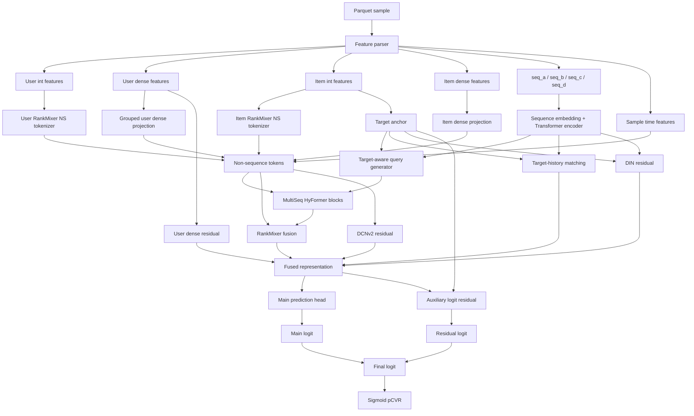

# DenseGroup MaxAUC SOTA

<p align="center">
  
  
  
  
</p>

[中文](README.md)

DenseGroup MaxAUC SOTA is the final solution for the Tencent Ads Algorithm Competition pCVR prediction task. The model uses a HyFormer backbone for multi-domain behavior sequences, fuses user/item categorical features, dense numerical features, four behavior sequences, and sample-time features, and improves AUC through four zero-initialized residual branches.

- Competition: [Tencent Ads Algorithm Leaderboard](https://algo.qq.com/leaderboard)
- Final rank: 53 / 1875, Top 2.83%
- Eval AUC: 0.832181
- Final configuration: all four MaxAUC residual branches enabled, `emb_skip_threshold=1100000`, `ema_decay=0.9995`

## Highlights

| Component | Design |
| --- | --- |
| Multi-sequence backbone | `seq_a/seq_b/seq_c/seq_d` are encoded by Transformer encoders, then fused by target-aware query generation and HyFormer blocks |
| Non-sequence features | user/item int features are converted by RankMixer NS tokenizer, while dense features are projected into NS tokens |
| Target matching | target-history matching explicitly models the relevance between the candidate ad/item and user history |
| MaxAUC branches | user dense residual, DIN-style target-aware sequence residual, DCNv2 cross residual, auxiliary logit residual |
| Training enhancement | Focal Loss for sparse conversion labels, EMA weight averaging, and raw/EMA validation selection |
| Engineering | streaming Parquet reader, row-group validation split, sequence truncation/padding, high-cardinality embedding filtering, bf16 autocast |

## Architecture



## Repository Layout

```text
densegroup_maxauc_sota/
├── dataset.py          # Parquet IterableDataset, schema parser, sequence padding
├── model.py            # PCVRHyFormer + MaxAUC residual branches
├── train.py            # Training entry point and CLI flags
├── trainer.py          # Focal/BCE training loop, AUC eval, EMA checkpoint selection
├── utils.py            # logging, seed, early stopping, focal loss helpers
├── densegroup.py       # dense feature grouping helper
├── ns_groups.json      # optional group-tokenizer config, not used by SOTA run.sh
├── run.sh              # final SOTA training command
├── eval/
│   ├── infer.py        # evaluation/inference entry point
│   ├── dataset.py      # eval-side dataset copy
│   └── model.py        # eval-side model copy
├── requirements.txt
├── README.md
└── README_EN.md
```

## Installation

Python 3.10+ and a CUDA GPU with bf16 autocast support are recommended.

```bash
pip install -r requirements.txt
```

Core dependencies include PyTorch, NumPy, PyArrow, scikit-learn, tqdm, and TensorBoard.

## Data Format

The training data directory should contain:

```text
TRAIN_DATA_PATH/
├── schema.json
└── *.parquet
```

`schema.json` describes feature id, offset, length, and vocab size for user/item int features, dense features, and sequence features. `dataset.py` streams Parquet files and builds:

- `user_int_feats`
- `user_dense_feats`
- `item_int_feats`
- `item_dense_feats`
- `seq_a/seq_b/seq_c/seq_d`
- `*_len`
- `*_time_bucket`
- `sample_day_id/sample_hour_id/sample_hour_sin/sample_hour_cos`
- `label`

The competition dataset is not redistributed with this repository.

## Training

```bash
export TRAIN_DATA_PATH=/path/to/train_data
export TRAIN_CKPT_PATH=/path/to/output/ckpt
export TRAIN_LOG_PATH=/path/to/output/log
export TRAIN_TF_EVENTS_PATH=/path/to/output/events

bash run.sh
```

`run.sh` pins the final SOTA configuration:

```bash
--ns_tokenizer_type rankmixer
--user_ns_tokens 5
--item_ns_tokens 2
--num_queries 2
--emb_skip_threshold 1100000
--use_target_history_matching
--use_user_dense_groups
--use_user_dense_residual
--use_din_residual
--din_top_k 80
--use_dcn_residual
--dcn_low_rank 128
--use_aux_logit_residual
--ema_decay 0.9995
--eval_raw_and_ema
--loss_type focal
--focal_alpha 0.1
--focal_gamma 2.0
```

## Inference / Evaluation

Set the following environment variables:

```bash
export MODEL_OUTPUT_PATH=/path/to/checkpoint_dir
export EVAL_DATA_PATH=/path/to/eval_data
export EVAL_RESULT_PATH=/path/to/results

python eval/infer.py
```

`MODEL_OUTPUT_PATH` should point to a checkpoint directory containing `model.pt`, `schema.json`, and `train_config.json`. `infer.py` first rebuilds the model from `train_config.json`; if it is missing, it falls back to the SOTA configuration bundled in this repository.

Output:

```text
$EVAL_RESULT_PATH/predictions.json
```

## Key Configuration

| Parameter | Value | Description |
| --- | --- | --- |
| `d_model` | 64 | Backbone hidden size |
| `num_queries` | 2 | Query tokens generated for each sequence domain |
| `num_hyformer_blocks` | 2 | Number of HyFormer blocks |
| `seq_max_lens` | `seq_a:256,seq_b:256,seq_c:512,seq_d:512` | Sequence truncation lengths |
| `emb_skip_threshold` | 1100000 | Skips extremely high-cardinality embedding tables |
| `ema_decay` | 0.9995 | EMA weight averaging decay |
| `loss_type` | `focal` | Focal Loss for sparse conversion labels |
| `focal_alpha/gamma` | `0.1/2.0` | Focal Loss parameters |

## Open-source Notes

- This repository contains model, training, and inference code only. It does not include raw competition data, private logs, or checkpoints.
- To use your own data, provide `schema.json` and Parquet columns compatible with `dataset.py`.
- `ns_groups.json` is an optional GroupNSTokenizer config. The final SOTA `run.sh` uses RankMixer NS tokenizer and disables this config with `--ns_groups_json ""`.

## Citation

```bibtex
@misc{densegroup-maxauc-sota,
  title  = {DenseGroup MaxAUC SOTA for pCVR Prediction},
  author = {Zikang Chen @ Tsinghua, Siqi Wu @ UESTC},
  year   = {2026},
  note   = {Tencent Ads Algorithm Competition, rank 53/1875, eval AUC 0.832181}
}
```

<!-- Generated by Codex ads-readme-generate workflow. -->
